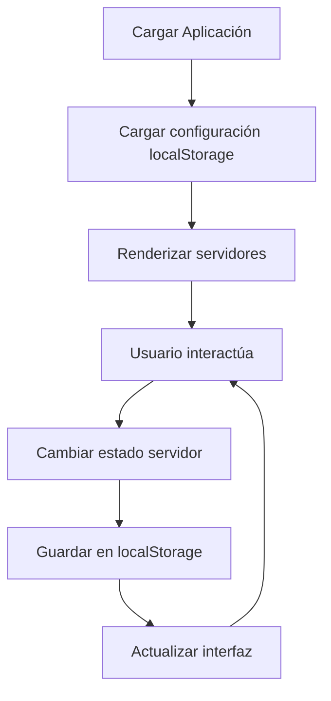

# 🔧 Documentación de la API

## 📚 Descripción General

El Gestor de Servidores MCP está construido con JavaScript vanilla y proporciona una API simple para gestionar servidores MCP. Esta documentación está dirigida a desarrolladores que deseen contribuir o extender la funcionalidad.

## 🏗️ Arquitectura

### **Clase Principal: MCPServerManager**

```javascript
class MCPServerManager {
    constructor()           // Inicializa el gestor
    init()                 // Configura la aplicación
    renderServers()        // Renderiza la interfaz
    toggleServer(id)       // Activa/desactiva servidor
    showConfig(id)         // Muestra configuración
    exportConfig()         // Exporta configuración completa
}
```

## 📋 Propiedades Principales

### **servers** (Object)
Contiene la configuración de todos los servidores MCP disponibles.

```javascript
{
    serverId: {
        name: string,           // Nombre del servidor
        description: string,    // Descripción del servidor
        command: string,        // Comando para ejecutar
        args: array,           // Argumentos del comando
        icon: string,          // Emoji del icono
        active: boolean,       // Estado activo/inactivo
        category: string,      // Categoría del servidor
        env: object           // Variables de entorno (opcional)
    }
}
```

### **categories** (Object)
Define las categorías disponibles para organizar servidores.

```javascript
{
    categoryId: {
        name: string,    // Nombre de la categoría
        icon: string     // Emoji del icono
    }
}
```

## 🔧 Métodos Públicos

### **toggleServer(serverId)**
Activa o desactiva un servidor MCP.

```javascript
// Parámetros
serverId: string  // ID único del servidor

// Ejemplo de uso
mcpManager.toggleServer('filesystem');
```

### **showConfig(serverId)**
Muestra el modal de configuración para un servidor específico.

```javascript
// Parámetros
serverId: string  // ID único del servidor

// Ejemplo de uso
mcpManager.showConfig('github');
```

### **exportConfig()**
Genera y descarga un archivo JSON con la configuración de todos los servidores activos.

```javascript
// Sin parámetros
// Retorna: Descarga automática de archivo

// Ejemplo de uso
mcpManager.exportConfig();
```

### **exportActiveOnly()**
Muestra la configuración de solo los servidores activos en un modal.

```javascript
// Sin parámetros
// Muestra: Modal con configuración JSON

// Ejemplo de uso
mcpManager.exportActiveOnly();
```

### **activateAll()**
Activa todos los servidores disponibles.

```javascript
// Sin parámetros
mcpManager.activateAll();
```

### **deactivateAll()**
Desactiva todos los servidores.

```javascript
// Sin parámetros
mcpManager.deactivateAll();
```

## 🔧 Métodos Privados

### **loadSettings()**
Carga la configuración guardada desde localStorage.

### **saveSettings()**
Guarda la configuración actual en localStorage.

### **createServerCard(key, server)**
Crea el elemento DOM para una tarjeta de servidor.

```javascript
// Parámetros
key: string     // ID del servidor
server: object  // Configuración del servidor

// Retorna
HTMLElement     // Elemento DOM de la tarjeta
```

### **updateStats()**
Actualiza las estadísticas mostradas en la interfaz.

### **showNotification(message, type)**
Muestra una notificación temporal al usuario.

```javascript
// Parámetros
message: string  // Mensaje a mostrar
type: string     // 'success', 'error', 'info'
```

## 🎨 Eventos del DOM

### **Modal de Configuración**
```javascript
// Cerrar modal con la X
closeBtn.onclick = () => modal.style.display = 'none';

// Cerrar modal haciendo clic fuera
window.onclick = (event) => {
    if (event.target === modal) {
        modal.style.display = 'none';
    }
};
```

### **Botones de Acción Global**
```javascript
exportBtn.onclick = () => this.exportConfig();
exportActiveBtn.onclick = () => this.exportActiveOnly();
activateAllBtn.onclick = () => this.activateAll();
deactivateAllBtn.onclick = () => this.deactivateAll();
```

## 💾 Almacenamiento Local

### **Estructura de localStorage**
```javascript
'mcp-servers-config': {
    serverId: {
        active: boolean
    }
}
```

### **Ejemplo de datos guardados**
```javascript
{
    "filesystem": { "active": true },
    "memory": { "active": false },
    "github": { "active": true }
}
```

## 🔄 Flujo de Datos



## 🛠️ Extender la Funcionalidad

### **Agregar un nuevo servidor**

```javascript
// 1. Añadir al objeto servers
mcpManager.servers.nuevoServidor = {
    name: 'Mi Servidor Personalizado',
    description: 'Descripción del servidor',
    command: 'node',
    args: ['path/to/server.js'],
    icon: '🔧',
    active: false,
    category: 'custom'
};

// 2. Añadir nueva categoría si es necesaria
mcpManager.categories.custom = {
    name: 'Personalizado',
    icon: '⚙️'
};

// 3. Re-renderizar
mcpManager.renderServers();
```

### **Añadir nueva funcionalidad**

```javascript
// Ejemplo: Filtrar por estado activo
MCPServerManager.prototype.filterActiveServers = function() {
    const cards = document.querySelectorAll('.server-card');
    cards.forEach(card => {
        const isActive = card.classList.contains('active');
        card.style.display = isActive ? 'block' : 'none';
    });
};
```

## 🎨 Personalizar Estilos

### **Variables CSS Disponibles**
```css
:root {
    --primary-color: #f5f5f5;
    --secondary-color: #ffffff;
    --accent-color: #007bff;
    --text-color: #333333;
    --text-light: #666666;
    --border-color: #e0e0e0;
    --shadow-color: rgba(156, 156, 156, 0.3);
    --hover-shadow: rgba(0, 123, 255, 0.15);
}
```

### **Clases CSS Principales**
- `.server-card` - Tarjeta de servidor
- `.server-card.active` - Tarjeta activa
- `.btn-primary` - Botón principal
- `.modal` - Modal de configuración
- `.notification` - Notificaciones

## 🔍 Debugging

### **Habilitar logs detallados**
```javascript
// En la consola del navegador
localStorage.setItem('mcp-debug', 'true');
location.reload();
```

### **Inspeccionar estado actual**
```javascript
// Ver configuración actual
console.log(mcpManager.servers);

// Ver servidores activos
console.log(Object.entries(mcpManager.servers)
    .filter(([_, server]) => server.active));

// Ver localStorage
console.log(JSON.parse(localStorage.getItem('mcp-servers-config')));
```

## 🧪 Testing

### **Pruebas manuales**
1. ✅ Activar/desactivar servidores
2. ✅ Exportar configuración
3. ✅ Copiar al portapapeles
4. ✅ Responsividad en diferentes dispositivos
5. ✅ Persistencia de configuración

### **Pruebas automatizadas (futuro)**
```javascript
// Ejemplo de test con Jest
describe('MCPServerManager', () => {
    test('should toggle server state', () => {
        const manager = new MCPServerManager();
        expect(manager.servers.filesystem.active).toBe(false);
        manager.toggleServer('filesystem');
        expect(manager.servers.filesystem.active).toBe(true);
    });
});
```

## 📦 Build y Deploy

### **Para desarrollo local**
```bash
# Servir localmente
npx serve . -p 3000
```

### **Para GitHub Pages**
```bash
# Automático con push a main
git push origin main
```

## 🚀 Próximas Mejoras

- [ ] **API REST** para gestión remota
- [ ] **WebSockets** para sincronización en tiempo real
- [ ] **Service Worker** para funcionalidad offline
- [ ] **Tests automatizados** con Jest/Cypress
- [ ] **TypeScript** para mejor tipado
- [ ] **Estado global** con Redux/Zustand

---

> **💡 Tip para desarrolladores**: Usa las herramientas de desarrollador del navegador (F12) para inspeccionar y modificar el comportamiento en tiempo real.